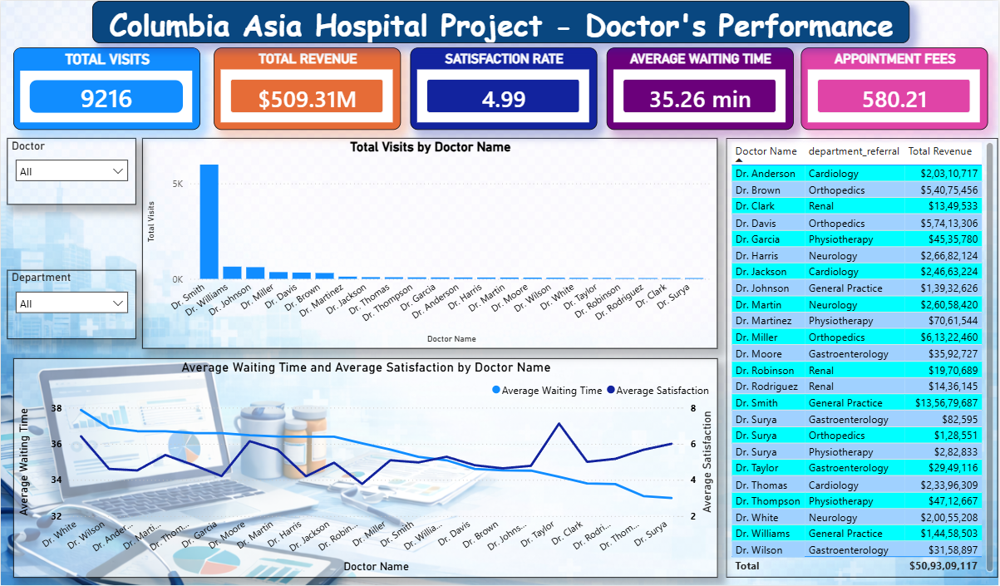
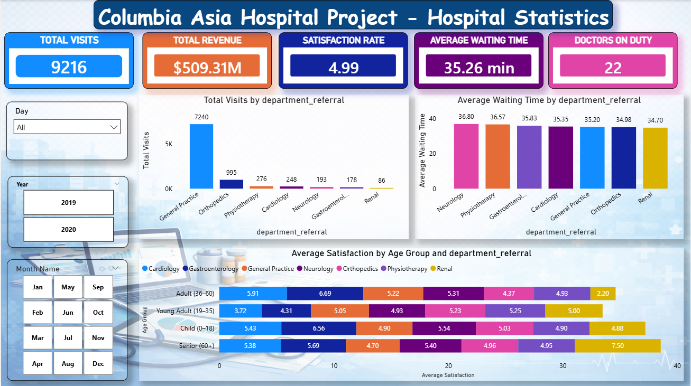
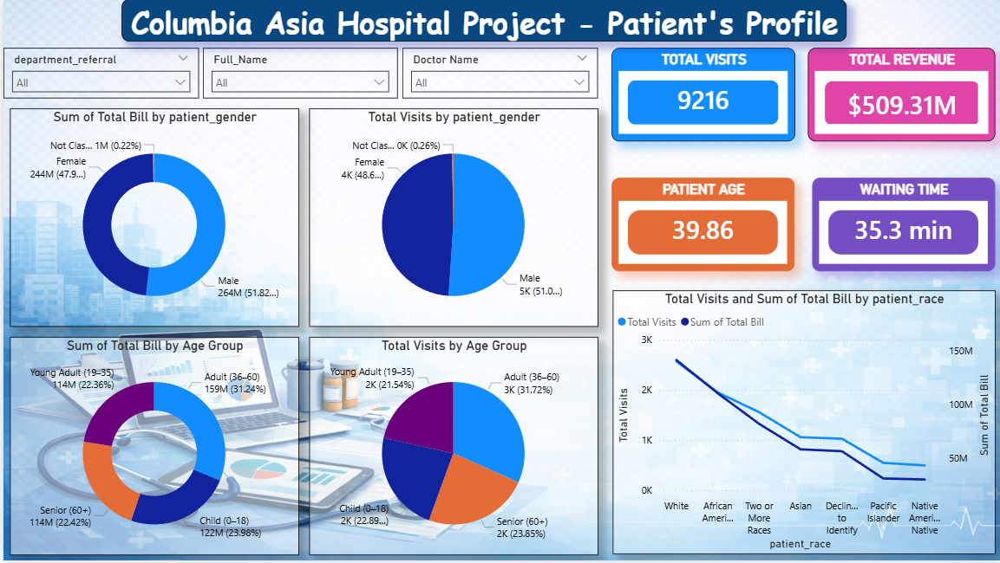

# Columbia Asia Hospital Analytics Project

## Overview
This project analyzes hospital operational, patient, and financial data to generate actionable insights using **Excel, SQL, and Power BI**.  
The goal is to understand patient behavior, operational efficiency, departmental performance, and revenue distribution to support better decision‑making.

---

## Tools & Technologies
- **Excel** – Initial data exploration
- **SQL** – Data querying and analytical questions
- **Power BI** – Data modeling, dashboard development, and visualization
- **DAX** – KPI calculations and analytical measures

---

## Dataset Description
The project uses hospital datasets containing patient visits, doctor information, departmental referrals, billing data, and satisfaction metrics.

### Key Attributes
- Patient ID
- Doctor ID
- Department Referral
- Patient Age
- Patient Gender
- Patient Race
- Waiting Time
- Satisfaction Score
- Appointment Fees
- Total Bill
- Visit Date

---

## Data Modeling
A **Star Schema** data model was implemented to improve analytical performance.

### Fact Table
**Fact_Patient_Visit**
- Patient_ID
- Doctor_ID
- Department_ID
- Visit_Date
- Waiting_Time
- Satisfaction_Score
- Total_Bill

### Dimension Tables
- **Dim_Doctor**
- **Dim_Department**
- **Dim_Patient**
- **Dim_Date**

---

## Key KPIs
- Total Patient Visits
- Total Revenue
- Average Waiting Time
- Average Patient Satisfaction
- Department-wise Visits
- Revenue by Doctor
- Patient Demographics

---

## Dashboard Pages

### Main Dashboard
- Daily Visits
- Revenue Generated
- Average Waiting Time
- Patient Satisfaction
- Department Workload

### Doctors Dashboard
- Doctor Performance Metrics
- Revenue Generated per Doctor
- Visits per Doctor
- Waiting Time vs Satisfaction

### Patients Dashboard
- Patient Demographics
- Visit History
- Total Amount Paid
- Most Visited Department

---

## Dashboard Preview

### Main Dashboard


### Doctors Dashboard


### Patients Dashboard


---

## Key Insights
- **General Practice** handles the majority of hospital visits.
- Adults aged **36–60** generate the highest revenue contribution.
- Patient satisfaction tends to decrease when waiting time exceeds **35 minutes**.
- Doctor workload distribution is uneven, with certain doctors handling significantly more visits.
- Revenue distribution across gender and race remains balanced.

---

## Recommendations
- Improve staffing in high‑traffic departments such as General Practice.
- Reduce average waiting time to improve patient satisfaction.
- Redistribute doctor workload to avoid operational bottlenecks.
- Introduce targeted programs for the most valuable patient demographic segments.

---

## Project Structure
```
columbia-asia-hospital-analytics
│
├── dashboards
│   ├── main_dashboard.png
│   ├── doctors_dashboard.png
│   └── patients_dashboard.png
│
├── powerbi
│   └── columbia_asia_hospital_report.pbix
│
├── sql
│   └── hospital_analysis_queries.sql
│
├── presentation
│   └── hospital_analytics_presentation.pptx
│
├── documentation
│   └── project_report.docx
│
└── README.md

---

## Author
**Prakamya Verma**  
Data Analytics Project – Healthcare Analytics
